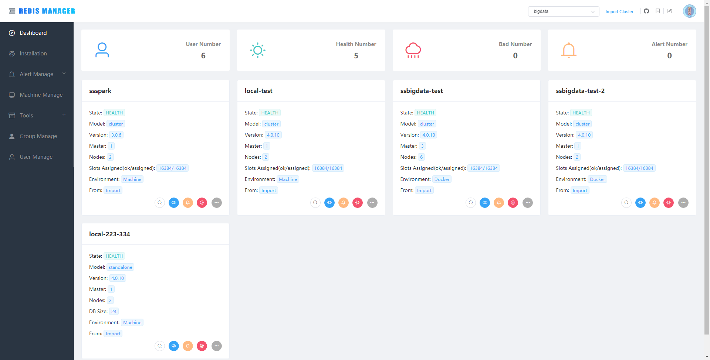
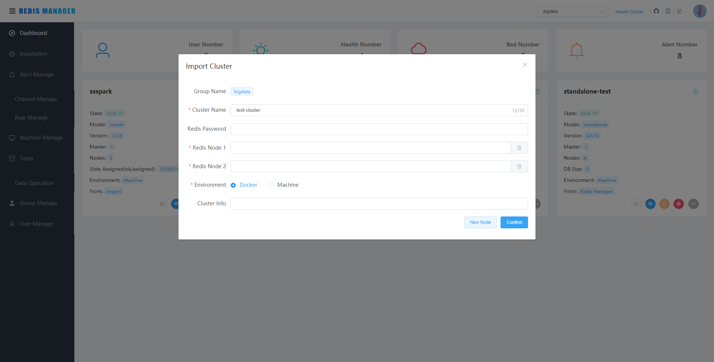
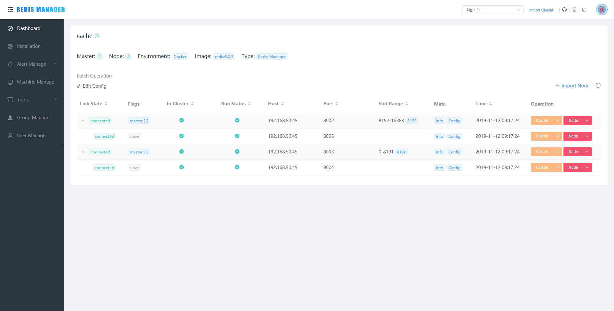
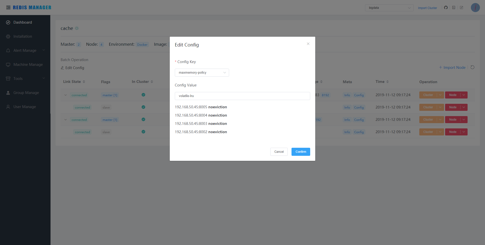
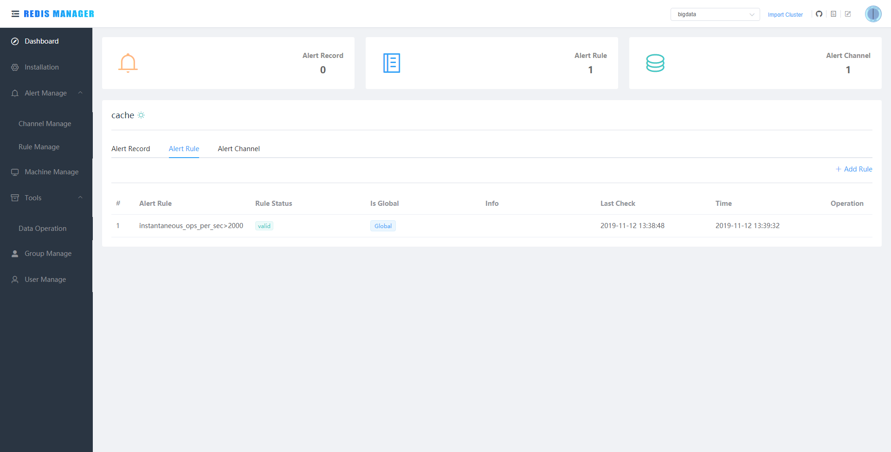
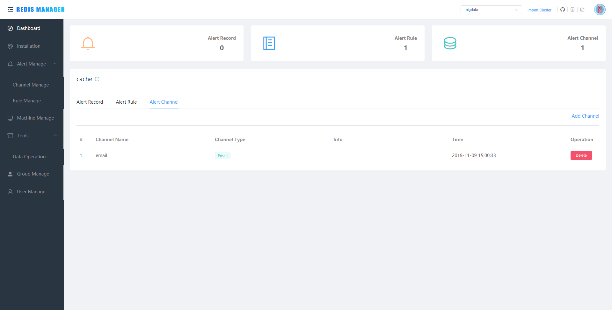
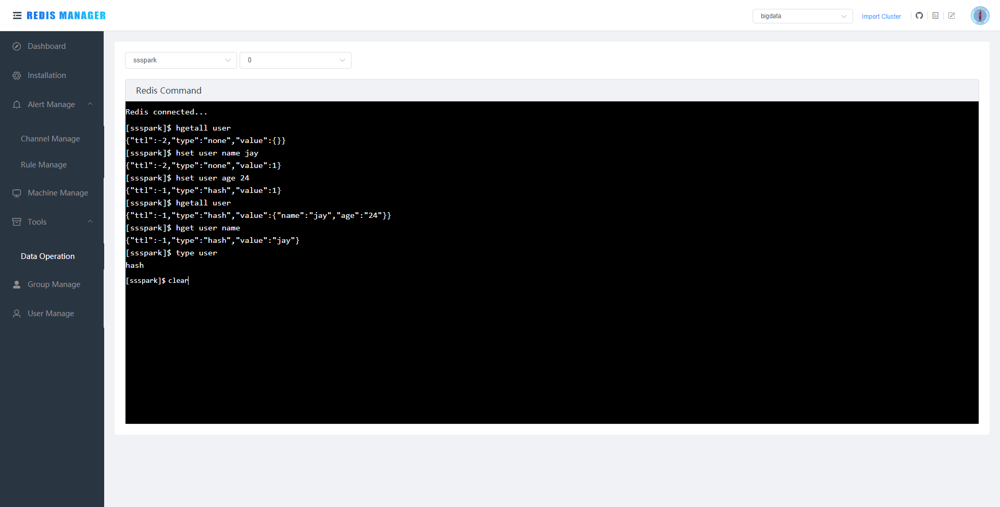
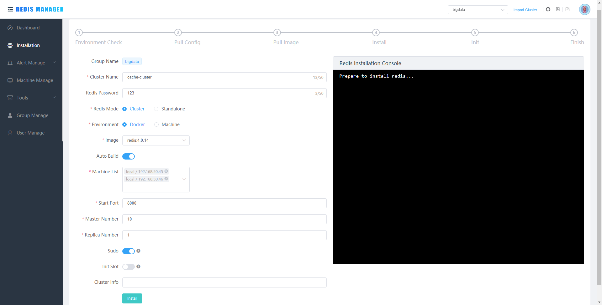
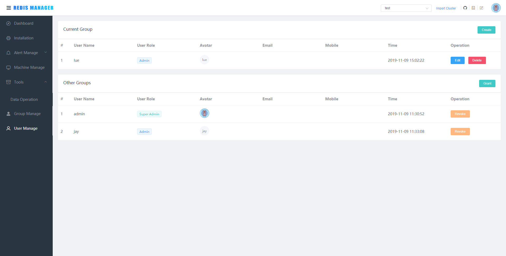

# Redis Manager

[](https://travis-ci.org/ngbdf/redis-manager)
[](https://www.apache.org/licenses/LICENSE-2.0)

**Redis Manager** 是 Redis 一站式管理平台，支持集群（cluster、master-replica、sentinel）的监控、安装（除sentinel）、管理、告警以及基本的数据操作功能  
**集群监控**：支持监控 Memory、Clients 等 Redis 重要指标；可实时查看 Redis Info、Redis Config 和 Slow Log  
**集群创建**：支持 Docker、Machine、Humpback方式  
**集群管理**：支持节点Forget、Replicate Of、Failover、Move Slot、Start、Stop、Restart、Delete、修改配置等功能  
**集群告警**：支持 Memory、Clients 等指标(同监控指标)，支持邮件、企业微信APP、企业微信Webhook、钉钉告警  
**工具箱**：支持 Query、Scan 以及基本的数据操作

[使用手册](https://github.com/ngbdf/redis-manager/wiki/)

# 安装
[快速启动](https://github.com/ngbdf/redis-manager/wiki/2.x-%E5%BF%AB%E9%80%9F%E5%90%AF%E5%8A%A8)

## Docker容器启动
[Dockerhub](https://hub.docker.com/repository/docker/reasonduan/redis-manager)
```sh
$sudo docker run -d --net=host --name redis-manager  \
-e DATASOURCE_DATABASE='redis_manager' \
-e DATASOURCE_URL='jdbc:mysql://127.0.0.1:3306/redis_manager?useUnicode=true&characterEncoding=utf-8&serverTimezone=GMT%2b8' \
-e DATASOURCE_USERNAME='root' \
-e DATASOURCE_PASSWORD='******' \
reasonduan/redis-manager
```
## 二进制包
[releases](https://github.com/ngbdf/redis-manager/releases)

# 联系方式
> 您在使用产品的过程中如果遇到问题或者发现需要改进的地方可以通过以下方式直接联系我们或 Pull Request。

Redis Manager 钉钉交流群  


知乎专栏  https://zhuanlan.zhihu.com/c_1055846842708930560

云栖社区  https://yq.aliyun.com/album/227?spm=a2c4e.11155435.0.0.3ece24f0lQw15C

# 产品主要功能介绍
## Dashboard    
> 展示当前用户组监控的所有集群  



## 集群导入  
> 导入已存在集群



## 集群监控  
> 监控 Memory、Clients 等 Redis 重要指标; 查询 Slow Log  


## 集群管理
> 支持节点Forget、Replicate Of、Failover、Move Slot、Start、Stop、Restart、Delete、修改配置等功能  



> 修改配置文件



## 集群告警
> 支持邮件、企业微信APP、企业微信Webhook、钉钉告警  





## 数据操作
> 支持简单的数据操作



## 创建集群      
> 目前支持 Redis Cluster、Standalone 模式的创建，包括机器安装、Docker 安装和 Humpback 安装方式  


	
## 用户组管理  


## 用户管理  



## 用户手册
> 用户手册主要介绍如何使用 Redis Manager

[快速启动](https://github.com/ngbdf/redis-manager/wiki/2.x-%E5%BF%AB%E9%80%9F%E5%90%AF%E5%8A%A8)  
[导入已存在集群](https://github.com/ngbdf/redis-manager/wiki/2.x-%E5%AF%BC%E5%85%A5%E5%B7%B2%E5%AD%98%E5%9C%A8%E7%9A%84%E9%9B%86%E7%BE%A4)  
[集群监控](https://github.com/ngbdf/redis-manager/wiki/2.x-%E9%9B%86%E7%BE%A4%E7%9B%91%E6%8E%A7)  
[节点管理](https://github.com/ngbdf/redis-manager/wiki/2.x-%E8%8A%82%E7%82%B9%E7%AE%A1%E7%90%86)  
[数据操作](https://github.com/ngbdf/redis-manager/wiki/2.x-%E6%95%B0%E6%8D%AE%E6%93%8D%E4%BD%9C)  
[集群告警](https://github.com/ngbdf/redis-manager/wiki/2.x-%E9%9B%86%E7%BE%A4%E5%91%8A%E8%AD%A6)  
[机器管理](https://github.com/ngbdf/redis-manager/wiki/2.x-%E6%9C%BA%E5%99%A8%E7%AE%A1%E7%90%86)  
[集群安装](https://github.com/ngbdf/redis-manager/wiki/2.x-%E9%9B%86%E7%BE%A4%E5%AE%89%E8%A3%85)  
[组和用户](https://github.com/ngbdf/redis-manager/wiki/2.x-%E7%BB%84%E5%92%8C%E7%94%A8%E6%88%B7%E7%AE%A1%E7%90%86)
## License
RedisManager is Open Source software released under the  [Apache 2.0 license](http://www.apache.org/licenses/LICENSE-2.0.html)


