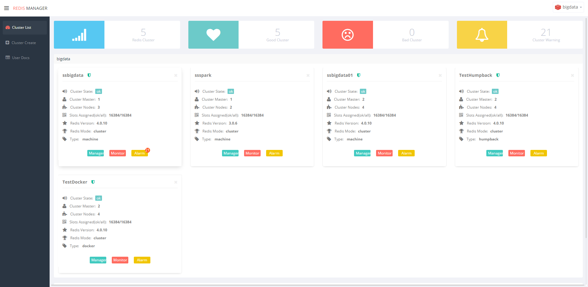
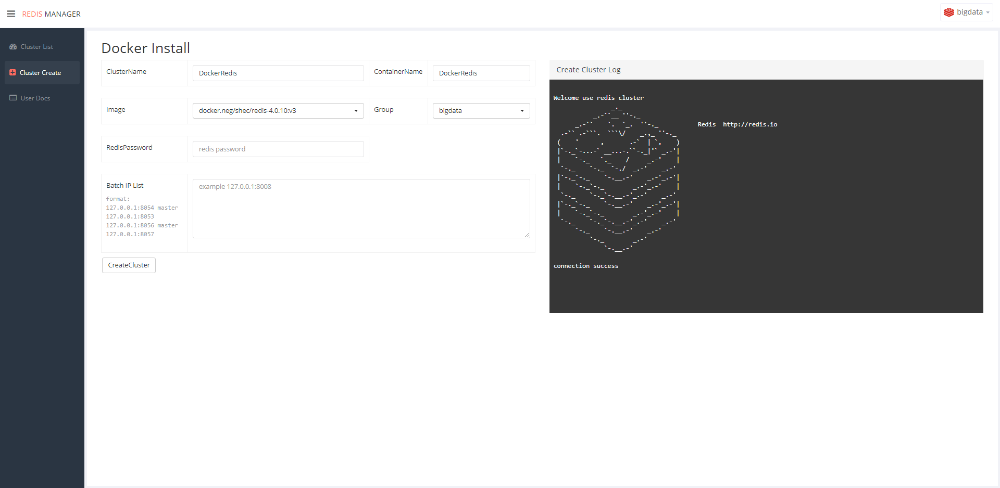
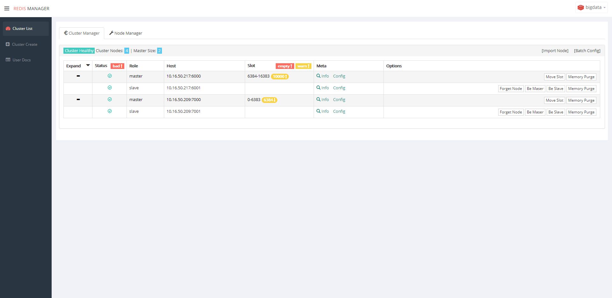
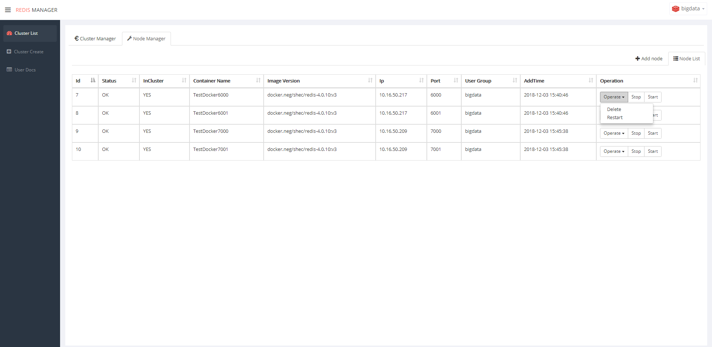
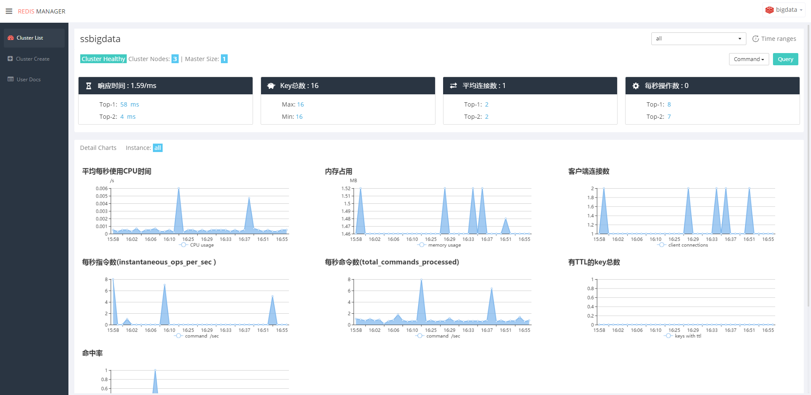
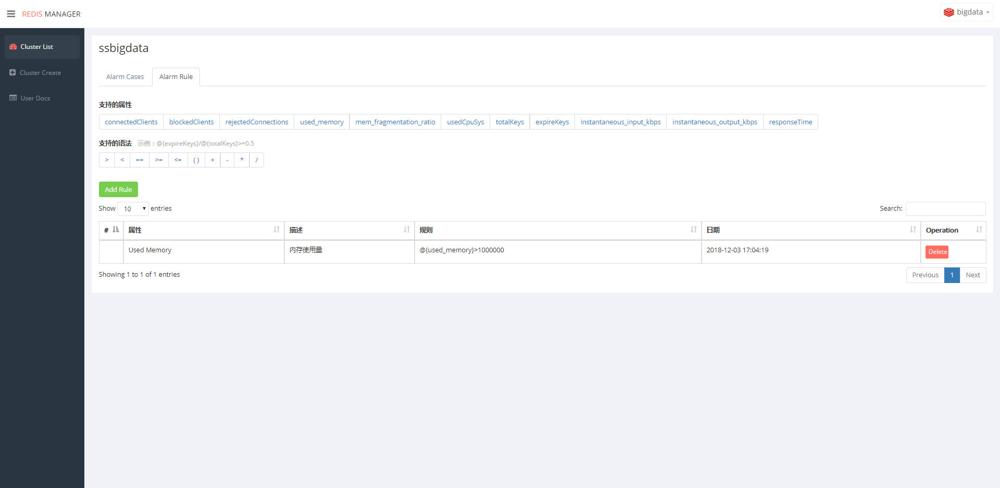
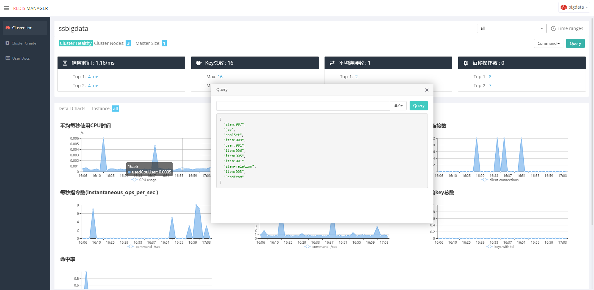

# RedisManager

RedisManager 是  redis 一站式管理平台。 支持集群的创建、管理、监控。      
集群的创建包含了三种方式 docker、machine、humpback;集群的管理支持 slot迁移、master slave 角色的选举、动态配置的修改;监控部分有 redis info、 slow log;集群之间数据同步;以及可以查询任意类型的query接口。

[快速开始](https://github.com/ngbdf/redis-manager/wiki/) 

## 联系方式
> 您在使用产品的过程中如果遇到问题或者需要改进的地方可以通过以下两种方式直接联系我们

1. RedisManager讨论群      

2. RedisManager微信群     
 

## 产品截图
> 截图部分包含了 创建模块、管理模块、监控模块、集群同步、query客户端的使用，详情如下:            

### 1 创建集群      
> 创建集群包含了三种选择、您可以选择机器安装也可以选择 docker 或 humpback            

  
### 2 管理集群
> 管理集群分为 ClusterManager、NodeManager 两部分

#### 2.1 ClusterManager
> 集群管理主要包好了 slot 迁移、master slave 角色切换、动态配置

#### 2.2 NodeManager
> 节点管理主要包含了节点的启动关闭重启扩容等

### 3 redis监控
> 监控包含了 redis detail 和 cluster alarm 两个部分的内容

### 3.1 具体监控详情

### 3.2 集群报警功能

### 4 Query客户端
> 支持任意类型的 key 查询，包含 scan功能

	
## 用户手册
> 用户手册主要介绍如何使用 redisManager

0. [如何启动项目](https://github.com/ngbdf/redis-manager/wiki/如何启动项目)
1. [如何创建集群](https://github.com/ngbdf/redis-manager/wiki/如何创建集群)
2. [如何管理或监控一个已存在的集群](https://github.com/ngbdf/redis-manager/wiki/如何管理或监控一个已存在的集群)
3. [如何管理集群](https://github.com/ngbdf/redis-manager/wiki/如何管理集群)
4. [如何管理节点](https://github.com/ngbdf/redis-manager/wiki/如何管理节点)
5. [如何查看监控](https://github.com/ngbdf/redis-manager/wiki/如何查看监控)
6. [query功能介绍](https://github.com/ngbdf/redis-manager/wiki/query功能介绍)

## 产品设计
> 设计文档主要介绍 redisMangaer 架构设计、框架设计

1. [代码结构介绍](https://github.com/ngbdf/redis-manager/wiki/代码结构介绍) 
2. [监控数据的采集](https://github.com/ngbdf/redis-manager/wiki/监控数据的采集)

## License
RedisManager is Open Source software released under the  [Apache 2.0 license](http://www.apache.org/licenses/LICENSE-2.0.html)

