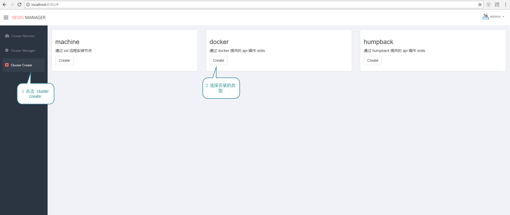
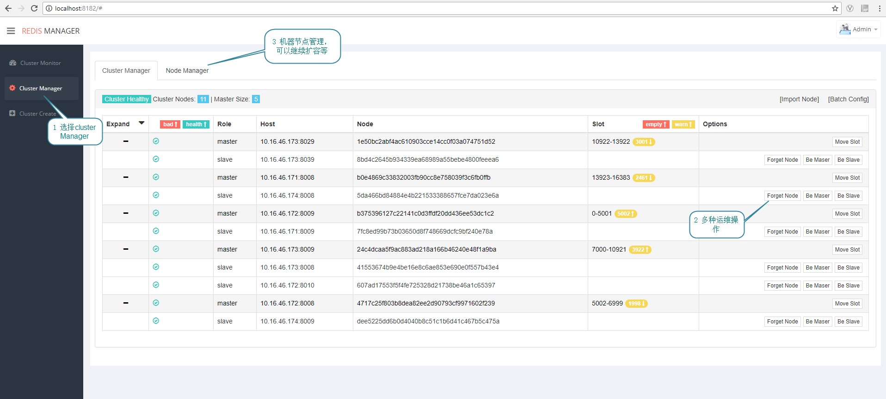
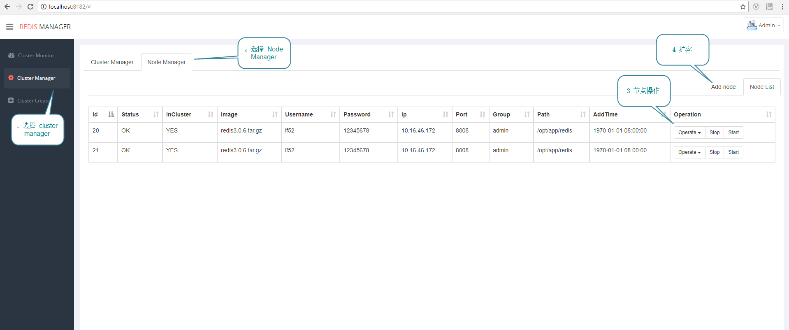
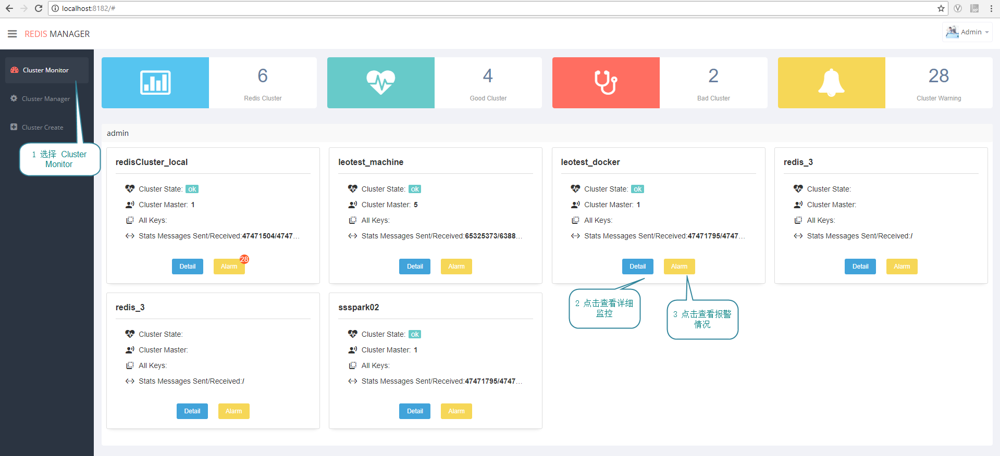
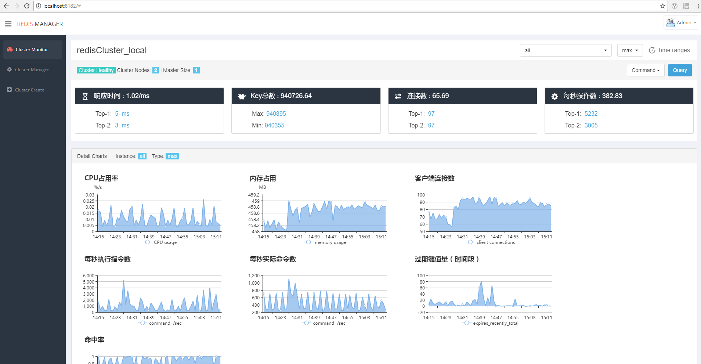

# RedisManager

RedisManager 是 newegg bigdata 部门研发的 redis 一站式管理平台,用于管理 newegg 内部 redis cluster 集群，支持集群的创建、管理、监控。
集群的创建包含了三种方式 docker、machine、humpback
集群的管理支持 slot迁移、master slave 角色的选举、动态配置的修改
监控部分有 redis info、 slow log 等。

## Screenshots
> 截图部分包含了 创建模块、管理模块、以及监控模块、详情如下:
### 1 创建集群
> 创建集群包含了三种选择、您可以选择机器安装也可以选择 docker 或 humpback

### 2 管理集群
> 管理集群分为 ClusterManager、NodeManager 两部分

#### 2.1 ClusterManager
> 集群管理主要包好了 slot 迁移、master slave 角色切换、动态配置

#### 2.2 NodeManager
> 节点管理主要包含了节点的启动关闭重启扩容等

### 3 redis监控
> 监控包含了 redis info 和 slow log 两个部分的内容

### 3.1 监控列表

### 3.2 具体监控详情

## User Docs
> 用户手册主要介绍如何使用 redisManager

1. [如何创建集群](/docs/README.md)
2. [如何管理或监控一个已存在的集群](/docs/README.md)
3. [如何管理集群](/docs/README.md)
4. [如何管理节点](/docs/README.md)
5. [如何查看监控](/docs/README.md)
6. [query功能介绍](/docs/README.md)

## Design Docs
> 设计文档主要介绍 redisMangaer 架构设计、框架设计

1. [代码结构介绍](/docs/frame-design.md)

